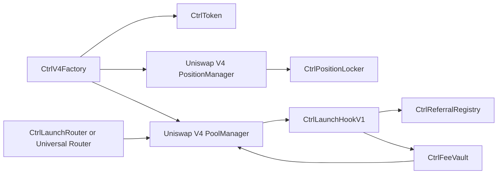

# Ctrl Immutable Launch Hook

Source for the direct, non-upgradeable Ctrl Uniswap V4 hook deployed on
**Robinhood Chain mainnet (4663)** on September 15, 2026.

**Hook:** [`0x5aE59a607FBE48e62270272Ee0eC266a544368cc`](https://robinhoodchain.blockscout.com/address/0x5aE59a607FBE48e62270272Ee0eC266a544368cc?tab=contract)
· [Source](src/CtrlLaunchHookV1.sol)
· [Sourcify exact match](https://repo.sourcify.dev/4663/0x5aE59a607FBE48e62270272Ee0eC266a544368cc)
· [Deployment manifest](deployments/4663-mainnet.json)
· [Routing review guide](docs/routing-review.md)

`CtrlLaunchHookV1` inherits `IHooks` directly. It has no proxy, UUPS inheritance,
delegatecall, implementation setter, or upgrade entry point. Its five constructor
dependencies are immutable. `initializeFactory` is one-time wiring and has already
been completed for this deployment.

## Contracts

| Contract and source | Deployed address |
| --- | --- |
| [CtrlLaunchHookV1](src/CtrlLaunchHookV1.sol) | `0x5aE59a607FBE48e62270272Ee0eC266a544368cc` |
| [CtrlV4Factory](src/CtrlV4Factory.sol) | `0xf10677910B82bBC6861ED78d7706174924DD767d` |
| [CtrlLaunchRouter](src/CtrlLaunchRouter.sol) | `0x09cCA9Cc4A6e33770224EaCBBB4f3c9E8F212EB5` |
| [CtrlFeeVault](src/CtrlFeeVault.sol) | `0x7eFCE9ff1b6F8aB5f37747DFd3E46547b655f97E` |
| [CtrlReferralRegistry](src/CtrlReferralRegistry.sol) | `0x5F02169f808d602992664C8Ddc2FE44c751646B2` |
| [CtrlPositionLocker](src/CtrlPositionLocker.sol) | `0x1d9018570F5203C76DC560eC7774995348934A6e` |
| [CtrlHookCreate2Deployer](script/DeployCtrl.s.sol) | `0xA4EC369b9950233D9E53f9047BB4131D251fB776` |
| [CtrlToken](src/CtrlToken.sol) | A new token is created for each launch |

The repository also contains all transitive Solidity imports, protocol interfaces,
liquidity math, the original deployment script, and the relevant local and fork
tests. [Dependency versions and licenses](DEPENDENCIES.md) are preserved.



## Build and test

Install [Foundry](https://getfoundry.sh/). The original deployment used Foundry
commit `5e88010a83d1b87b8f4d13058e42a2949d3e9dc0`, available as release
`nightly-5e88010a83d1b87b8f4d13058e42a2949d3e9dc0`. Solidity **0.8.26**, Cancun,
optimizer **200 runs**, and `via_ir = true`
are fixed in `foundry.toml`. Dependencies are vendored; no `forge install`, npm
install, signing key, or RPC is needed for the local suite. Python 3.9+ is used
for source and bytecode checks.

```bash
git clone https://github.com/wanesurf/ctrl-immutable-hook.git
cd ctrl-immutable-hook
forge build
forge test
./scripts/test-immutable-deployment.sh
python3 scripts/verify-source.py
```

The verifier checks every copied source hash, compiler metadata, and the creation
bytecode of all seven deployed contracts against the deployment build. Original
source paths and the complete deployment remappings are retained because they
affect the metadata embedded in bytecode. See [reproduction and verification](docs/verification.md).

For a read-only comparison against the deployed runtime, including constructor
immutables and compiler metadata:

```bash
python3 scripts/verify-source.py --rpc-url https://rpc.ctrl.finance
```

For the optional fork tests using the deployed Uniswap Universal Router:

```bash
RH_MAINNET_RPC_URL=https://rpc.ctrl.finance ./scripts/test-immutable-fork.sh
```

Fork tests create a fresh local stack on a fork. They do not send mainnet
transactions. The RPC must provide state for the selected block. An archive RPC
is needed when reproducing an old block.

## Protocol and review status

- Pools pair a fixed-supply Ctrl token with native ETH, with a fixed 1% hook fee
  collected in ETH using return deltas. Core LP fee is zero; dynamic fees are disabled.
- All four swap modes accept empty hook data. Optional data supplies referral
  and graduation-beneficiary attribution.
- Only the initial factory seed position may be added. Its position NFT is
  permanently held by the locker. Graduation releases a fee-funded bounty and
  does not move liquidity or change the AMM pricing function.
- Factory and vault owners are the Safe
  `0x99Ffd2FdcaF29AFDDbbd49655F9331FF3AC1aA09`. Their powers and other state
  changes are described in the [routing review guide](docs/routing-review.md).

At publication, the new factory is paused. Existing tokens remain on their
original deployment. This repository is a source publication, not an application
cutover or contract activation. The immutable deployment is **unaudited** and has
not been approved by Uniswap Labs.

Sourcify reports an exact creation and runtime match. The last native Blockscout
Code-tab import check remains pending. Uniswap's form requires explorer
verification matching deployed bytecode; the repository link alone is insufficient.
A funded example pool and the submitter's contact details are also required.

## Source provenance

The Solidity files are copied byte-for-byte from the deployment source commit
`6a88f5718cea426bc3dfb1a0815ca87579044e55`. The historical deployment manifest is
retained as recorded. [Source provenance](verification/source-provenance.json)
records file hashes and creation-bytecode fingerprints. This repository has a
fresh publication history; it contains the immutable stack and its review inputs.

## License

Ctrl source files carry the MIT SPDX identifier. Vendored dependencies retain
their original SPDX identifiers and license files, including Uniswap V4 Core's
BUSL-1.1 and MIT files. See [DEPENDENCIES.md](DEPENDENCIES.md).
