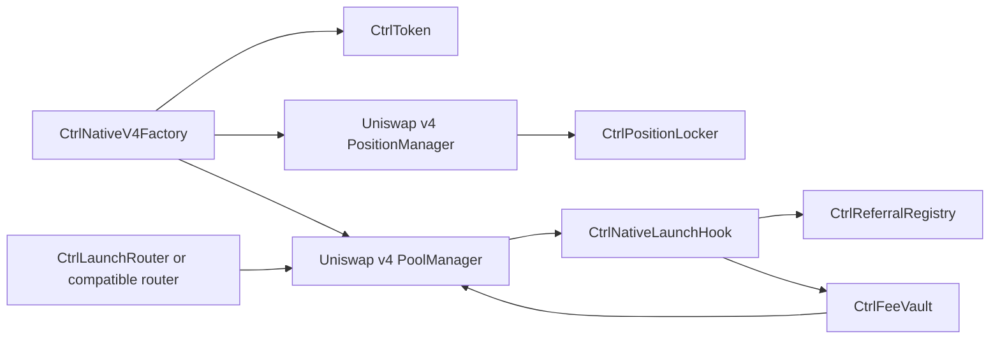

# Ctrl Finance — Immutable Launchpad on Arc

Launch a token directly into a **Uniswap v4 market paired with native USDC on
Arc**. Ctrl combines an immutable trading hook, creator and referral rewards,
permanently locked launch liquidity, and graduation within the same pool.

**[Launchpad](https://app.ctrl.finance/launchpad?chain=arc)** ·
**[Documentation](https://docs.ctrl.finance/)** ·
[Protocol & contracts](https://docs.ctrl.finance/protocol) ·
[Rewards](https://docs.ctrl.finance/rewards) ·
[Integration guide](docs/routing-review.md)

This repository publishes the deployed Arc contracts, ABIs, deployment records,
compiler inputs, and tests. The independent Robinhood Chain deployment is also
included. Always identify a contract by **chain ID and address**.

## What makes Ctrl distinctive

### Native-USDC launches and rewards

On Arc, tokens trade against native USDC, and launch fees, trading fees, and
reward claims use that same currency. The canonical pool uses the zero address
for its native currency, with **18 decimals**. Arc's six-decimal USDC ERC-20
interface is a different interface to the same balance; it is not the currency
address of Ctrl's launch pool.

### Creator rewards enforced by the hook

The fixed **1% Ctrl trading fee** is collected in native USDC through Uniswap v4
return deltas. The hook allocates that fee onchain:

| Recipient | Share of the collected Ctrl fee |
| --- | --- |
| Creator | **80%** |
| Eligible registered referrer | **5%** |
| Graduation bounty reserve, before graduation | **2.5%** |
| Protocol treasury | Remainder |

An ineligible or absent referral allocation goes to the protocol. After
graduation, the bounty allocation also goes to the protocol. Integer-rounding
remainders stay with the protocol. These percentages divide the fee, not the
trade's full value. The pool's core LP fee is zero; dynamic LP fees are disabled.

The [fee vault](src/CtrlFeeVault.sol) tracks recipient-specific balances backed
by native-currency ERC-6909 claims in Uniswap's PoolManager. Recipients withdraw
their own credited rewards. See [how rewards work](https://docs.ctrl.finance/rewards).

### One pool from launch through graduation

Each launch creates a fixed supply of **1 billion tokens**, opens its Uniswap v4
pool, and seeds its initial token liquidity in one transaction. An optional
initial purchase executes in that same transaction with minimum-output and
deadline protection.

The launch position's NFT is permanently held by
[CtrlPositionLocker](src/CtrlPositionLocker.sol), which has no withdrawal path.
The hook permits only the initial factory seed position to be added.
**Graduation does not migrate liquidity or switch pricing curves.** It records
that net native principal crossed the threshold and releases the accumulated
bounty to the supplied beneficiary, falling back to the current treasury when
no beneficiary is supplied. Trading continues in the same Uniswap v4 pool.

### Fixed hook code and deployment economics

[CtrlNativeLaunchHook](src/CtrlNativeLaunchHook.sol) implements `IHooks` directly.
It has no proxy, delegatecall, upgrade entry point, or hook administrator. The
factory binding is one-time and complete. Arc's launch fee, initial tick, and
graduation threshold are fixed at deployment.

The factory owner can pause **future launches**, and the vault owner can update
the treasury. Creators can change their future payout address. These powers do
not change the hook code or redirect balances already credited to a recipient.
The unreleased bounty's fallback recipient is the treasury at graduation; see
[authority and accounting details](docs/routing-review.md#immutability-and-authority).

## Arc mainnet contracts

**Chain ID: 5042** · Deployed September 16, 2026 · Factory start block: **21,178,639**

| Contract / source | Arc address | ABI |
| --- | --- | --- |
| [CtrlNativeLaunchHook](src/CtrlNativeLaunchHook.sol) | [0xE0e48AE841741c1C5A6eFa1DEe2838E62d5168CC](https://explorer.arc.io/address/0xE0e48AE841741c1C5A6eFa1DEe2838E62d5168CC) | [JSON](abi/CtrlNativeLaunchHook.json) |
| [CtrlNativeV4Factory](src/CtrlNativeV4Factory.sol) | [0x936eED62da1a4e7A7fb1fABFe2e10C4bCbD7B322](https://explorer.arc.io/address/0x936eED62da1a4e7A7fb1fABFe2e10C4bCbD7B322) | [JSON](abi/CtrlNativeV4Factory.json) |
| [CtrlLaunchRouter](src/CtrlLaunchRouter.sol) | [0xe5fC122B4563bAcbAF429cFa78Ae9Cb1D1A93686](https://explorer.arc.io/address/0xe5fC122B4563bAcbAF429cFa78Ae9Cb1D1A93686) | [JSON](abi/CtrlLaunchRouter.json) |
| [CtrlFeeVault](src/CtrlFeeVault.sol) | [0xADa4794e5Ac54Df44C9608b23C14684458Af7367](https://explorer.arc.io/address/0xADa4794e5Ac54Df44C9608b23C14684458Af7367) | [JSON](abi/CtrlFeeVault.json) |
| [CtrlReferralRegistry](src/CtrlReferralRegistry.sol) | [0xF412eD814fe5821910CFEDE4910f7231c51D9EC5](https://explorer.arc.io/address/0xF412eD814fe5821910CFEDE4910f7231c51D9EC5) | [JSON](abi/CtrlReferralRegistry.json) |
| [CtrlPositionLocker](src/CtrlPositionLocker.sol) | [0x1eFe83337744F5e84fD51b01BD4e57fD013454d3](https://explorer.arc.io/address/0x1eFe83337744F5e84fD51b01BD4e57fD013454d3) | [JSON](abi/CtrlPositionLocker.json) |
| [CtrlNativeHookCreate2Deployer](script/DeployCtrlArc.s.sol) | [0xc897570c27AF50603A08490C8621e3d0EFfa4b27](https://explorer.arc.io/address/0xc897570c27AF50603A08490C8621e3d0EFfa4b27) | [JSON](abi/CtrlNativeHookCreate2Deployer.json) |
| [CtrlToken](src/CtrlToken.sol) | A new token is created for each launch | [JSON](abi/CtrlToken.json) |

[Deployment manifest](deployments/5042-mainnet.json) ·
[Hook's Sourcify source match](https://repo.sourcify.dev/5042/0xE0e48AE841741c1C5A6eFa1DEe2838E62d5168CC) ·
[Arc compiler inputs and provenance](verification/5042-mainnet) ·
[Uniswap dependency addresses](DEPENDENCIES.md#existing-external-deployments)

### Fixed Arc economics

| Parameter | Deployed value |
| --- | --- |
| Launch fee | **1.19373 USDC**, excluding gas and any initial purchase |
| Graduation threshold | **10,027.332 USDC** of net native principal, not market cap or cumulative volume |
| Initial tick / tick spacing | **126400 / 200** |
| Ctrl hook fee / core LP fee | **1% / 0%** |

The launch fee and threshold were set using the deployment-time ETH/USD
reference of 2,387.46 to preserve the approximate Robinhood USD economics.
They do not follow later ETH prices. See the manifest's `economics` record and
[protocol documentation](https://docs.ctrl.finance/protocol).

### Example canonical Arc pool

[ARAIDERS on Ctrl](https://app.ctrl.finance/launchpad/0x318e2d646b698ed632694113fd870a0e98ab6054?chain=arc):

- Token: `0x318e2D646b698ed632694113fd870a0e98ab6054`
- Pool ID: `0xabb4fad3bfadb04fa90c917b327180d20141f57520c8fb26b48e6138ceaf9220`
- Pool key: native USDC (`address(0)`), ARAIDERS, LP fee `0`, tick spacing `200`, Arc Ctrl hook above.

Integrators should discover tokens through the factory's `TokenLaunched` events
and confirm the pool through `poolIdForToken` / `poolKey` on the hook. Other pools
can exist for the same token with different fees and liquidity. The
[integration guide](docs/routing-review.md) covers quoting, hook data, indexing,
and native-USDC units.

## Contract flow



## Build, test, and verify

Install [Foundry](https://getfoundry.sh/). Solidity **0.8.26**, Cancun, optimizer
**200 runs**, and `via_ir = true` are pinned in `foundry.toml`. Dependencies are
vendored; the local suite needs no RPC or signing key. Python **3.9+** is used
for verification. The tested Foundry build is
`nightly-5e88010a83d1b87b8f4d13058e42a2949d3e9dc0`.

```bash
git clone https://github.com/wanesurf/ctrl-immutable-hook.git
cd ctrl-immutable-hook
forge build
forge test
./scripts/test-immutable-deployment.sh
python3 scripts/verify-source.py --chain-id 5042
python3 scripts/verify-source.py --chain-id 4663
```

Read-only Arc runtime verification, including compiler metadata and constructor
immutables:

```bash
python3 scripts/verify-source.py --chain-id 5042 \
  --rpc-url https://rpc.mainnet.arc.io
```

Optional Arc fork tests against deployed Uniswap PoolManager and PositionManager:

```bash
RUN_ARC_FORK_TESTS=true ARC_MAINNET_RPC_URL=https://rpc.mainnet.arc.io \
  forge test --match-contract CtrlArcForkTest
```

The fork suite creates a fresh stack locally and never broadcasts. It uses a
pinned block and needs historical RPC state. Arc-specific native-USDC transfer
restrictions require the Arc Foundry runtime for full chain fidelity. See
[reproduction and verification](docs/verification.md) for that command, the
scope of each test, and Robinhood checks.

## Robinhood Chain deployment

The separate **Robinhood Chain mainnet (4663)** stack pairs tokens with native
ETH. Its hook and factory have different addresses and source entry points.
Shared router, vault, registry, locker, and token source files serve both chains.

| Contract / source | Robinhood address |
| --- | --- |
| [CtrlLaunchHookV1](src/CtrlLaunchHookV1.sol) | `0x5aE59a607FBE48e62270272Ee0eC266a544368cc` |
| [CtrlV4Factory](src/CtrlV4Factory.sol) | `0xf10677910B82bBC6861ED78d7706174924DD767d` |
| [CtrlLaunchRouter](src/CtrlLaunchRouter.sol) | `0x09cCA9Cc4A6e33770224EaCBBB4f3c9E8F212EB5` |
| [CtrlFeeVault](src/CtrlFeeVault.sol) | `0x7eFCE9ff1b6F8aB5f37747DFd3E46547b655f97E` |
| [CtrlReferralRegistry](src/CtrlReferralRegistry.sol) | `0x5F02169f808d602992664C8Ddc2FE44c751646B2` |
| [CtrlPositionLocker](src/CtrlPositionLocker.sol) | `0x1d9018570F5203C76DC560eC7774995348934A6e` |
| [CtrlHookCreate2Deployer](script/DeployCtrl.s.sol) | `0xA4EC369b9950233D9E53f9047BB4131D251fB776` |

[Robinhood manifest](deployments/4663-mainnet.json) ·
[Robinhood hook source match](https://repo.sourcify.dev/4663/0x5aE59a607FBE48e62270272Ee0eC266a544368cc)

## Verification and review scope

The source verifier checks source hashes, ABIs, compiler metadata, and creation
bytecode. With an RPC URL it also compares the entire deployed runtime,
including immutable values, at one recorded block. All seven Arc contracts have
exact Sourcify creation/runtime matches recorded in the deployment manifest.

Deployment manifests preserve historical snapshots, including the initial
paused state. Consult the dated [Arc live verification report](verification/5042-mainnet/live-verification.json)
or rerun the verifier for a current launch count and pause status.

Source matching and tests do not establish audit coverage or aggregator
approval. The [published V12 audit documentation](https://docs.ctrl.finance/security-audit)
references the earlier V2 hook; it should not be presented as an audit of these
exact immutable Arc contracts. No independent audit of this Arc deployment is
recorded in this repository.

## Source provenance and license

The Arc sources are reproduced byte-for-byte from the deployment's Standard
JSON inputs. Their hashes, original source-base commit, and build fingerprints
are recorded in [Arc provenance](verification/5042-mainnet/source-provenance.json).
The base commit predates the Arc additions; the preserved compiler inputs
identify the exact deployed source. The original Robinhood publication retains
its own [provenance](verification/source-provenance.json).

Ctrl sources carry MIT SPDX identifiers. Vendored dependencies retain their
licenses, including Uniswap v4 Core's BUSL-1.1 and MIT files. See
[DEPENDENCIES.md](DEPENDENCIES.md).
